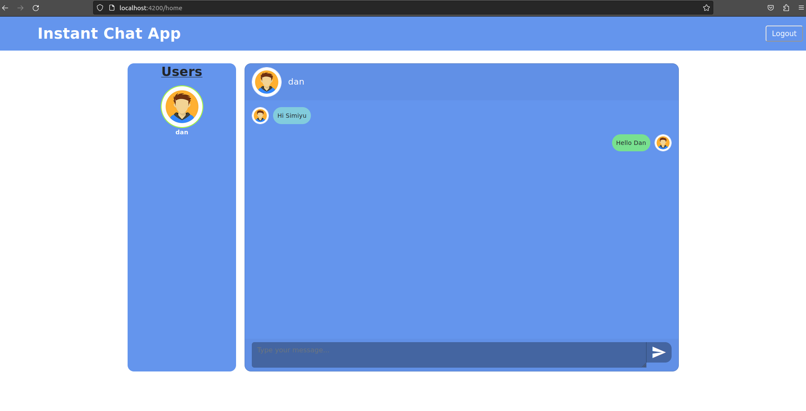

# Instant Messaging App
Sample instant messaging application using java spring back-end and Angular front-end 

[]

## How to run

### With Docker
- Easy way of running both back-end and frond-end is to use docker. Change directory to this directory (directory containing this README.md file).
- For first time run `docker-compose up -d --build` first time and just `docker-compose up -d` anytime later as long as you have not removed the images. This command will build both API and client and start them in docker. This might take a few minutes. 

NOTE: If you stop the application by docker containers before logging out and start it later in the browser, you must logout to clear session storage.

### Locally in IDE
- Open `instantChat/src/main/resources/application.properties` and change database username/password to match your database.
- Run backend using IDE or by terminal by changing directory to instantChat folder and run `/gradlew bootRun`.
- Run frond-end by changing directory to chat-client directory and run `npm install && npm start`.

### Login or Signup
- Open your browser to go to `http://localhost:4200/`.
- You can either login or sign up.
- Sign up more than one user for you to chat. 

## Tech Stack

### back-end
- Java 11
- Postgres database
- Spring Boot 2.7.11 
- Lombok
- Mapstruct
- Spring JPA

### frond-end
- Node 16
- Angular 15
- HTML 5
- SCSS
- Typescript 4

